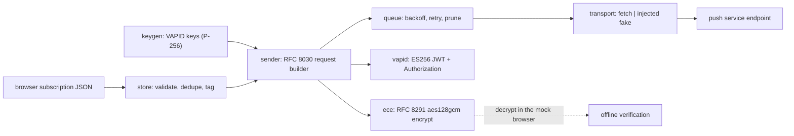

# pushforge

[English](README.md) | [中文](README.zh.md) | [日本語](README.ja.md)

[](LICENSE)   [](CONTRIBUTING.md)

**ランタイム依存ゼロのセルフホスト Web Push 送信ツール——VAPID 鍵、RFC 8291 暗号化、購読ストア、リトライ付き配送キューを、すべて Node の webcrypto 上に構築。標準のブラウザプッシュ：アプリ不要、独自プロトコル不要、購読者リストが第三者の手に渡ることもない。**


```bash
# not yet on npm — install from a checkout of this repository
npm install && npm run build && npm pack
npm install -g ./pushforge-0.1.0.tgz
```

## なぜ pushforge？

いまや主要ブラウザはすべて Web Push を搭載している——普通のウェブサイトで「許可」を一度タップしたユーザーは、アプリのインストールもベンダーへの登録もなしに通知を受け取れる。それでも多くのインディー開発者はこの能力を OneSignal 型の SaaS（購読者リストを握り、収益化する）に預けるか、ntfy や Gotify のようなセルフホスト代替（優れたツールだが、*自前のアプリやページに自前のプロトコルで*届けるものであり、ブラウザネイティブのプッシュ経路ではない）を使っている。残る道——RFC 8030/8291/8292 を自分で話すこと——は通常 `web-push` npm パッケージとその依存ツリーを意味する。pushforge はこの隙間を素の Node で埋める：VAPID 鍵の生成、バイト単位で正確な RFC 8291 暗号化（RFC 自身のテストベクタで検証済み）、`cat` で読める JSON 購読ストア、指数バックオフと死んだ購読の自動削除を備えたクラッシュ安全な配送キュー。さらに*ブラウザ側*の復号まで実装しているため、パイプライン全体を完全オフラインで自己検証できる——`keygen → add → send --dry-run → decrypt`——実際のプッシュサービスに触れる前に。

| 能力 | pushforge | ntfy | Gotify | OneSignal | web-push (npm) |
|---|---|---|---|---|---|
| ブラウザネイティブのプッシュ（service worker）へ配送 | はい | 自前の Web アプリ経由 | 専用アプリ/WebSocket | はい | はい |
| ユーザー端末へのインストール不要 | はい | アプリかページ常時表示 | アプリ必須 | はい | はい |
| 購読者リストの持ち主 | あなた（JSON ファイル） | あなたのサーバー | あなたのサーバー | OneSignal | あなた（保存は自前） |
| 購読ストア + 配送キューを同梱 | はい | キューのみ | キューのみ | ホスティング | いいえ——ライブラリのみ |
| オフラインのエンドツーエンドテスト経路（モック購読者 + 復号） | はい | いいえ | いいえ | いいえ | いいえ |
| ランタイム依存 | 0 | Go バイナリ | Go バイナリ | SaaS | 約 6 個 |

<sub>能力・依存数は各プロジェクトの公開ドキュメントとレジストリのメタデータで確認、2026-07。</sub>

## 特徴

- **本物であることを証明済みの RFC 8291 暗号化**——P-256 ECDH、二段 HKDF、`aes128gcm` フレーミングでの AES-128-GCM。テストスイートは RFC 8291 付録 A のベクタをバイト単位で再現する——あらゆるブラウザが認める相互運用のアンカーだ。
- **RFC 8292 を文字どおり実装した VAPID**——プッシュサービスの origin にスコープした ES256 JWT、subject 検証、24 時間の有効期限上限、そして組み立て済みの `vapid t=…, k=…` ヘッダー。
- **完全にあなたのものである購読者リスト**——購読は信頼境界で検証され（https エンドポイント、65 バイトの P-256 公開点、16 バイトの auth シークレット）、エンドポイントで重複排除、タグでルーティングでき、読める JSON ファイル 1 つへアトミックに永続化。
- **現実に耐える配送キュー**——指数バックオフ（30s → 2m → 8m → 32m、上限 1h）、プッシュサービスのステータス契約（2xx 送信済み、404/410 は死んだ購読を削除、429/5xx はリトライ、他の 4xx は即時失敗）、クラッシュ安全なディスク状態、注入可能なクロックとトランスポート。
- **設計段階からオフライン**——モック購読者は `PushManager.subscribe()` とまったく同じ鍵素材を生成し、`decrypt` はブラウザのように暗号文を開く：パイプライン全体がネットワークなしで自己検証でき、90 個のテストもすべてその方式で走る。
- **ランタイム依存ゼロ・テレメトリなし**——プラットフォームは Node ≥ 22.13 だけ。このツールが発する外向きリクエストは、あなたが明示的に頼んだプッシュ POST ただ 1 つ。

## クイックスタート

インストール：

```bash
# not yet on npm — install from a checkout of this repository
npm install && npm run build && npm pack
npm install -g ./pushforge-0.1.0.tgz
```

サーバーの身元を生成し、購読者をつなぎ、送信して検証——すべてオフライン（実際にキャプチャした実行結果）：

```bash
pushforge keygen --subject mailto:ops@example.test --out vapid.json
pushforge mock > sub.json        # a fake browser; real ones POST you this JSON
pushforge add sub.json --tag beta
pushforge send "Deploy finished: v2.4.1 is live" --vapid vapid.json \
    --tag beta --topic deploys --dry-run --out outbox
pushforge decrypt outbox/*.body
```

```text
wrote VAPID key pair to vapid.json
applicationServerKey (give this to the browser):
BIpgaep9x59eSa2ycsIn0tTgb5jdJkjyW0o4mDsoRqHswdrVBESEt3CGSXfsNPW6XIg3IvU_-PhYKaQII0joIzQ
wrote mock subscriber private keys to ua-keys.json
added 8c73db6bdd30 tags=[beta] (1 subscription in store)
[dry-run] 8c73db6bdd30 -> POST https://push.example.test (body 134 bytes, ttl 86400)
  body -> outbox/8c73db6bdd30.body
Deploy finished: v2.4.1 is live
```

最後の行は、本物の RFC 8291 暗号化を通ったメッセージが購読者の秘密鍵で戻ってきた姿だ。本番では `--dry-run` を外せば同じリクエストが実エンドポイントへ POST される。リトライが欲しければキューを使う（実際にキャプチャした実行結果）：

```bash
pushforge enqueue "Nightly digest ready" --all --ttl 3600
pushforge queue-status
```

```text
enqueued 1 job: job-1
job-1  pending  attempts=0/5  8c73db6bdd30
pending=1 sent=0 gone=0 failed=0
```

その後 `pushforge drain --vapid vapid.json` が期限の来たジョブを配送し、429/5xx でバックオフし、サービスが死んだと報告した購読を削除する。ブラウザ側コード（ページと service worker）は [examples/](examples/README.md) にある。

## CLI リファレンス

状態は普通の JSON ファイル（`vapid.json`、`subscriptions.json`、`queue.json`）にあり、各コマンドで `--vapid` / `--store` / `--queue` によりパスを上書きできる。

| コマンド | 効果 |
|---|---|
| `keygen [--subject URI] [--out FILE]` | VAPID 鍵を生成；`applicationServerKey` を表示 |
| `mock [--endpoint URL]` | ブラウザ形式の購読 + 独立した秘密鍵ファイルを生成 |
| `add [FILE\|-] [--tag TAG]…` | 購読を検証して保存（冪等、タグはマージ） |
| `list / remove` | ストアを確認（id 表示、capability URL は出さない）/ 削除 |
| `send MSG (--to ID… \| --tag TAG \| --all)` | いま暗号化して POST；`--dry-run --out DIR` はリクエストを保存 |
| `enqueue / drain / queue-status` | メッセージ投入、バックオフ付き配送、ジョブ確認 |
| `decrypt FILE [--keys FILE]` | 購読者の鍵で暗号文を開く（テスト用途） |

メッセージオプション：`--ttl N`（秒、既定 86400）、`--urgency very-low|low|normal|high`、`--topic T`（32 文字以下、待機中の古いプッシュを置換）。終了コード：`0` 成功、`1` 操作拒否（配送失敗、復号失敗）、`2` 用法/IO エラー。

## プロトコル解説

`docs/protocol.md` は 3 つの RFC（8030 配送、8291 暗号化、8292 VAPID）、正確なファイル形式、そして 0.1.0 の意図的な制限を解説する：単一レコードの `aes128gcm` のみ（実際のプッシュはすべてそう——サービスはボディを 4096 バイトに制限）、レガシーな `aesgcm` 符号化は非対応、キューは単一プロセス。プログラム API（`buildPushRequest`、`sendNotification`、`SubscriptionStore`、`DeliveryQueue`、`encrypt`/`decrypt`）は型付きで提供され、CLI 自身もその上に構築されている。

## アーキテクチャ



## ロードマップ

- [x] VAPID 鍵生成、RFC 8291 `aes128gcm` 暗号化/復号（付録 A 検証済み）、購読ストア、リトライ付き配送キュー、フル CLI、モック購読者、90 個のオフラインテスト（v0.1.0）
- [ ] `pushforge serve`：ブラウザの購読をストアへ直接受け取るループバック HTTP エンドポイント
- [ ] 配送失敗レポートのエクスポート（JSON）でダッシュボード連携
- [ ] 複数 worker が同一ファイルを安全に drain できるマルチプロセスのキューロック
- [ ] ペイロードテンプレート（title/body/actions 規約付きの JSON エンベロープ）

全リストは [open issues](https://github.com/JaydenCJ/pushforge/issues) を参照。

## コントリビュート

コントリビューションを歓迎します。`npm install && npm run build` でビルドし、`npm test`（90 テスト）と `bash scripts/smoke.sh`（`SMOKE OK` を表示すること）を実行——このリポジトリは CI を持たず、上記の主張はすべてローカル実行で検証される。[CONTRIBUTING.md](CONTRIBUTING.md) を読み、[good first issue](https://github.com/JaydenCJ/pushforge/issues?q=is%3Aissue+is%3Aopen+label%3A%22good+first+issue%22) を選ぶか、[discussion](https://github.com/JaydenCJ/pushforge/discussions) を始めてください。

## ライセンス

[MIT](LICENSE)
