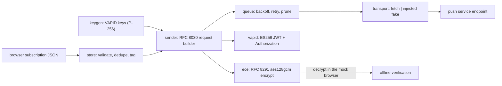

# pushforge

[English](README.md) | [中文](README.zh.md) | [日本語](README.ja.md)

[](LICENSE)   [](CONTRIBUTING.md)

**A self-hosted Web Push sender with zero runtime dependencies — VAPID keys, RFC 8291 encryption, a subscription store and a retrying delivery queue, all on Node's webcrypto. Standard browser push: no app, no custom protocol, no third party holding your subscriber list.**


```bash
# not yet on npm — install from a checkout of this repository
npm install && npm run build && npm pack
npm install -g ./pushforge-0.1.0.tgz
```

## Why pushforge?

Every current browser ships Web Push — a user who taps "Allow" on your plain website can receive notifications with no app installed and no vendor account created. Yet most indie developers still route that capability through OneSignal-style SaaS (which holds your subscriber list and monetizes it) or through self-hosted alternatives like ntfy and Gotify (excellent tools, but they deliver to *their own app or page via their own protocol*, not to the browser's native push pipeline). The remaining path — speaking RFC 8030/8291/8292 yourself — usually means the `web-push` npm package and its dependency tree. pushforge closes that gap with plain Node: VAPID key generation, byte-for-byte RFC 8291 encryption (verified against the RFC's own test vector), a JSON subscription store you can read with `cat`, and a crash-safe delivery queue with exponential backoff and automatic pruning of dead subscriptions. It even implements the *browser's* decryption side, so the entire pipeline is testable offline — `keygen → add → send --dry-run → decrypt` — before you touch a real push service.

| Capability | pushforge | ntfy | Gotify | OneSignal | web-push (npm) |
|---|---|---|---|---|---|
| Delivers to the browser's native push (service worker) | yes | via its web app | own app/WebSocket | yes | yes |
| Works with zero installs on the user's device | yes | app or its page open | app required | yes | yes |
| Who holds the subscriber list | you (a JSON file) | your server | your server | OneSignal | you (BYO storage) |
| Subscription store + delivery queue included | yes | queue only | queue only | hosted | no — library only |
| Offline end-to-end test path (mock subscriber + decrypt) | yes | no | no | no | no |
| Runtime dependencies | 0 | Go binary | Go binary | SaaS | ~6 |

<sub>Capability and dependency counts checked against each project's public docs and registry metadata, 2026-07.</sub>

## Features

- **Real RFC 8291 encryption, proven** — ECDH over P-256, two-stage HKDF, AES-128-GCM in `aes128gcm` framing; the test suite reproduces the RFC 8291 Appendix A vector byte-for-byte, the interop anchor every browser accepts.
- **VAPID done to the letter (RFC 8292)** — ES256 JWTs scoped to the push service's origin, subject validation, the 24-hour expiration cap, and the `vapid t=…, k=…` header assembled for you.
- **A subscriber list you own** — subscriptions validated at the trust boundary (https endpoint, 65-byte P-256 point, 16-byte auth secret), deduplicated by endpoint, tagged for routing, persisted atomically to one readable JSON file.
- **A delivery queue that survives reality** — exponential backoff (30s → 2m → 8m → 32m, capped at 1h), the push-service status contract (2xx sent, 404/410 prunes the dead subscription, 429/5xx retries, other 4xx fails fast), crash-safe on-disk state, injected clock and transport.
- **Offline by construction** — the mock subscriber generates exactly what `PushManager.subscribe()` would, and `decrypt` opens the encrypted body like a browser: the full pipeline verifies itself with no network, which is also how all 90 tests run.
- **Zero runtime dependencies, no telemetry** — Node ≥ 22.13 is the entire platform; the only outbound request this tool ever makes is the push POST you explicitly asked for.

## Quickstart

Install:

```bash
# not yet on npm — install from a checkout of this repository
npm install && npm run build && npm pack
npm install -g ./pushforge-0.1.0.tgz
```

Generate your server identity, wire in a subscriber, send, and verify — entirely offline (real captured run):

```bash
pushforge keygen --subject mailto:ops@example.test --out vapid.json
pushforge mock > sub.json        # a fake browser; real ones POST you this JSON
pushforge add sub.json --tag beta
pushforge send "Deploy finished: v2.4.1 is live" --vapid vapid.json \
    --tag beta --topic deploys --dry-run --out outbox
pushforge decrypt outbox/*.body
```

```text
wrote VAPID key pair to vapid.json
applicationServerKey (give this to the browser):
BIpgaep9x59eSa2ycsIn0tTgb5jdJkjyW0o4mDsoRqHswdrVBESEt3CGSXfsNPW6XIg3IvU_-PhYKaQII0joIzQ
wrote mock subscriber private keys to ua-keys.json
added 8c73db6bdd30 tags=[beta] (1 subscription in store)
[dry-run] 8c73db6bdd30 -> POST https://push.example.test (body 134 bytes, ttl 86400)
  body -> outbox/8c73db6bdd30.body
Deploy finished: v2.4.1 is live
```

That last line is the message coming back out of real RFC 8291 encryption via the subscriber's private keys. For production, drop `--dry-run` (the same request is POSTed to the real endpoint), or use the queue for retries (real captured run):

```bash
pushforge enqueue "Nightly digest ready" --all --ttl 3600
pushforge queue-status
```

```text
enqueued 1 job: job-1
job-1  pending  attempts=0/5  8c73db6bdd30
pending=1 sent=0 gone=0 failed=0
```

Then `pushforge drain --vapid vapid.json` delivers everything due, backs off on 429/5xx, and prunes subscriptions the service reports dead. Browser-side code (the page and the service worker) lives in [examples/](examples/README.md).

## CLI reference

State lives in plain JSON files (`vapid.json`, `subscriptions.json`, `queue.json`), overridable per command with `--vapid` / `--store` / `--queue`.

| Command | Effect |
|---|---|
| `keygen [--subject URI] [--out FILE]` | generate VAPID keys; prints the `applicationServerKey` |
| `mock [--endpoint URL]` | emit a browser-shaped subscription + private secrets file |
| `add [FILE\|-] [--tag TAG]…` | validate and store a subscription (idempotent, merges tags) |
| `list / remove` | inspect the store (ids, not capability URLs) / prune |
| `send MSG (--to ID… \| --tag TAG \| --all)` | encrypt + POST now; `--dry-run --out DIR` captures the request instead |
| `enqueue / drain / queue-status` | queue messages, deliver with retry/backoff, inspect jobs |
| `decrypt FILE [--keys FILE]` | open an encrypted body with subscriber keys (testing) |

Message options: `--ttl N` (seconds, default 86400), `--urgency very-low|low|normal|high`, `--topic T` (≤32 chars, replaces older pending pushes). Exit codes: `0` ok, `1` operation refused (failed delivery, bad decrypt), `2` usage/IO error.

## Protocol notes

`docs/protocol.md` walks the three RFCs (8030 delivery, 8291 encryption, 8292 VAPID), the exact file formats, and 0.1.0's deliberate limits: single-record `aes128gcm` only (all real pushes are — services cap bodies at 4096 bytes), no legacy `aesgcm` coding, single-process queue. The programmatic API (`buildPushRequest`, `sendNotification`, `SubscriptionStore`, `DeliveryQueue`, `encrypt`/`decrypt`) ships typed and is what the CLI itself is built on.

## Architecture



## Roadmap

- [x] VAPID keygen, RFC 8291 `aes128gcm` encrypt/decrypt (Appendix A verified), subscription store, retrying delivery queue, full CLI, mock subscriber, 90 offline tests (v0.1.0)
- [ ] `pushforge serve`: a loopback HTTP endpoint that accepts browser subscriptions straight into the store
- [ ] Declined-delivery report export (JSON) for feeding dashboards
- [ ] Multi-process queue locking so several workers can drain one file safely
- [ ] Payload templates (JSON envelopes with title/body/actions conventions)

See the [open issues](https://github.com/JaydenCJ/pushforge/issues) for the full list.

## Contributing

Contributions are welcome. Build with `npm install && npm run build`, then run `npm test` (90 tests) and `bash scripts/smoke.sh` (must print `SMOKE OK`) — this repository ships no CI, every claim above is verified by local runs. See [CONTRIBUTING.md](CONTRIBUTING.md), grab a [good first issue](https://github.com/JaydenCJ/pushforge/issues?q=is%3Aissue+is%3Aopen+label%3A%22good+first+issue%22), or start a [discussion](https://github.com/JaydenCJ/pushforge/discussions).

## License

[MIT](LICENSE)
