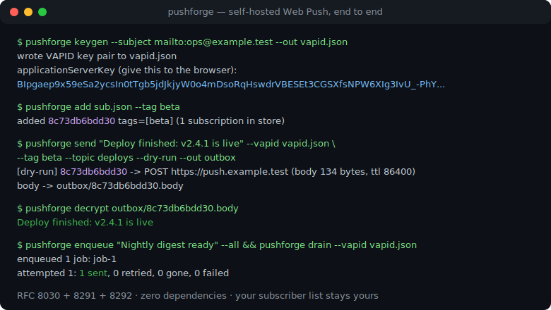
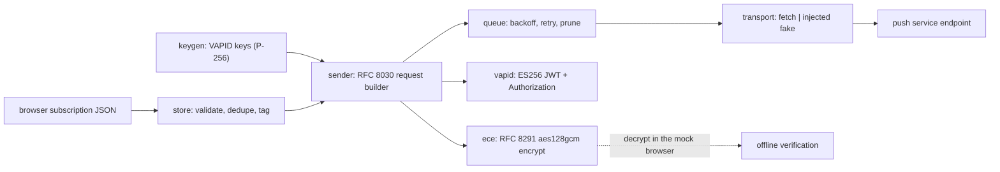

# pushforge

[English](README.md) | [中文](README.zh.md) | [日本語](README.ja.md)

[](LICENSE)   [](CONTRIBUTING.md)

**零运行时依赖的自托管 Web Push 发送器——VAPID 密钥、RFC 8291 加密、订阅存储与带重试的投递队列，全部构建在 Node 的 webcrypto 之上。标准浏览器推送：不需要 App，不需要私有协议，订阅者名单也不经任何第三方之手。**



```bash
# not yet on npm — install from a checkout of this repository
npm install && npm run build && npm pack
npm install -g ./pushforge-0.1.0.tgz
```

## 为什么选 pushforge？

如今每个主流浏览器都内置 Web Push——用户在你的普通网站上点一次"允许"，无需安装 App、无需注册任何厂商账号就能收到通知。然而多数独立开发者仍把这项能力交给 OneSignal 式的 SaaS（它掌握并变现你的订阅者名单），或使用 ntfy、Gotify 这类自托管替代品（优秀的工具，但它们通过*自己的 App 或页面、自己的协议*投递，而不是走浏览器原生的推送管线）。剩下的路——自己实现 RFC 8030/8291/8292——通常意味着 `web-push` npm 包及其依赖树。pushforge 用纯 Node 填补了这个缺口：VAPID 密钥生成、逐字节精确的 RFC 8291 加密（对照 RFC 自带的测试向量验证）、一个 `cat` 就能读的 JSON 订阅存储，以及带指数退避、自动清理死亡订阅、崩溃安全的投递队列。它甚至实现了*浏览器侧*的解密，因此整条管线可以完全离线自检——`keygen → add → send --dry-run → decrypt`——在触碰真实推送服务之前就验证完毕。

| 能力 | pushforge | ntfy | Gotify | OneSignal | web-push (npm) |
|---|---|---|---|---|---|
| 投递到浏览器原生推送（service worker） | 是 | 经由其 Web 应用 | 自有 App/WebSocket | 是 | 是 |
| 用户设备零安装即可用 | 是 | 需 App 或保持页面打开 | 必须装 App | 是 | 是 |
| 订阅者名单由谁掌握 | 你（一个 JSON 文件） | 你的服务器 | 你的服务器 | OneSignal | 你（自备存储） |
| 内置订阅存储 + 投递队列 | 是 | 仅队列 | 仅队列 | 托管 | 否——纯库 |
| 离线端到端测试路径（mock 订阅者 + 解密） | 是 | 否 | 否 | 否 | 否 |
| 运行时依赖 | 0 | Go 二进制 | Go 二进制 | SaaS | 约 6 个 |

<sub>能力与依赖数量核对自各项目的公开文档与注册表元数据，2026-07。</sub>

## 功能特性

- **真材实料且经过证明的 RFC 8291 加密**——P-256 ECDH、两级 HKDF、`aes128gcm` 帧格式下的 AES-128-GCM；测试套件逐字节复现 RFC 8291 附录 A 向量，那是每个浏览器都认可的互操作锚点。
- **严格按 RFC 8292 实现的 VAPID**——作用域限定到推送服务 origin 的 ES256 JWT、subject 校验、24 小时过期上限，以及为你拼装好的 `vapid t=…, k=…` 请求头。
- **完全归你所有的订阅者名单**——订阅在信任边界处逐项校验（https 端点、65 字节 P-256 公钥点、16 字节 auth 密钥），按端点去重，可打标签路由，原子化持久到一个可读的 JSON 文件。
- **经得起现实的投递队列**——指数退避（30s → 2m → 8m → 32m，上限 1h）、推送服务状态契约（2xx 已发送，404/410 清理死亡订阅，429/5xx 重试，其余 4xx 快速失败）、崩溃安全的磁盘状态、可注入的时钟与传输层。
- **从构造上就离线**——mock 订阅者生成与 `PushManager.subscribe()` 完全一致的密钥材料，`decrypt` 像浏览器一样打开加密体：整条管线无需网络即可自我验证，全部 90 个测试也是这样跑的。
- **零运行时依赖、零遥测**——Node ≥ 22.13 就是全部平台；本工具唯一的出站请求，是你明确要求的那次推送 POST。

## 快速上手

安装：

```bash
# not yet on npm — install from a checkout of this repository
npm install && npm run build && npm pack
npm install -g ./pushforge-0.1.0.tgz
```

生成服务器身份、接入一个订阅者、发送并验证——全程离线（真实捕获的运行结果）：

```bash
pushforge keygen --subject mailto:ops@example.test --out vapid.json
pushforge mock > sub.json        # a fake browser; real ones POST you this JSON
pushforge add sub.json --tag beta
pushforge send "Deploy finished: v2.4.1 is live" --vapid vapid.json \
    --tag beta --topic deploys --dry-run --out outbox
pushforge decrypt outbox/*.body
```

```text
wrote VAPID key pair to vapid.json
applicationServerKey (give this to the browser):
BIpgaep9x59eSa2ycsIn0tTgb5jdJkjyW0o4mDsoRqHswdrVBESEt3CGSXfsNPW6XIg3IvU_-PhYKaQII0joIzQ
wrote mock subscriber private keys to ua-keys.json
added 8c73db6bdd30 tags=[beta] (1 subscription in store)
[dry-run] 8c73db6bdd30 -> POST https://push.example.test (body 134 bytes, ttl 86400)
  body -> outbox/8c73db6bdd30.body
Deploy finished: v2.4.1 is live
```

最后一行，就是消息经真实 RFC 8291 加密后、再用订阅者私钥还原出来的样子。生产环境去掉 `--dry-run`（同样的请求会 POST 到真实端点），或改用队列获得重试（真实捕获的运行结果）：

```bash
pushforge enqueue "Nightly digest ready" --all --ttl 3600
pushforge queue-status
```

```text
enqueued 1 job: job-1
job-1  pending  attempts=0/5  8c73db6bdd30
pending=1 sent=0 gone=0 failed=0
```

随后 `pushforge drain --vapid vapid.json` 投递所有到期任务，对 429/5xx 退避重试，并清理被服务宣告死亡的订阅。浏览器侧代码（页面与 service worker）见 [examples/](examples/README.md)。

## CLI 参考

状态存于普通 JSON 文件（`vapid.json`、`subscriptions.json`、`queue.json`），每条命令均可用 `--vapid` / `--store` / `--queue` 覆盖路径。

| 命令 | 作用 |
|---|---|
| `keygen [--subject URI] [--out FILE]` | 生成 VAPID 密钥；打印 `applicationServerKey` |
| `mock [--endpoint URL]` | 生成浏览器形状的订阅 + 独立的私钥文件 |
| `add [FILE\|-] [--tag TAG]…` | 校验并入库一条订阅（幂等，标签合并） |
| `list / remove` | 查看存储（显示 id，不回显 capability URL）/ 删除 |
| `send MSG (--to ID… \| --tag TAG \| --all)` | 立即加密并 POST；`--dry-run --out DIR` 则把请求落盘 |
| `enqueue / drain / queue-status` | 消息入队、带退避重试投递、查看任务 |
| `decrypt FILE [--keys FILE]` | 用订阅者密钥打开加密体（测试用途） |

消息选项：`--ttl N`（秒，默认 86400）、`--urgency very-low|low|normal|high`、`--topic T`（≤32 字符，替换旧的待投递推送）。退出码：`0` 成功，`1` 操作被拒（投递失败、解密失败），`2` 用法/IO 错误。

## 协议说明

`docs/protocol.md` 讲解三份 RFC（8030 投递、8291 加密、8292 VAPID）、精确的文件格式，以及 0.1.0 的刻意取舍：仅支持单记录 `aes128gcm`（真实推送皆如此——服务把请求体上限设为 4096 字节）、不支持遗留的 `aesgcm` 编码、队列为单进程。编程 API（`buildPushRequest`、`sendNotification`、`SubscriptionStore`、`DeliveryQueue`、`encrypt`/`decrypt`）带完整类型，CLI 本身就构建在它之上。

## 架构



## 路线图

- [x] VAPID 密钥生成、RFC 8291 `aes128gcm` 加解密（附录 A 验证）、订阅存储、带重试的投递队列、完整 CLI、mock 订阅者、90 个离线测试（v0.1.0）
- [ ] `pushforge serve`：一个回环 HTTP 端点，把浏览器订阅直接收入存储
- [ ] 投递失败报告导出（JSON），便于接入仪表盘
- [ ] 多进程队列锁，让多个 worker 安全地 drain 同一个文件
- [ ] 负载模板（含 title/body/actions 约定的 JSON 信封）

完整列表见 [open issues](https://github.com/JaydenCJ/pushforge/issues)。

## 参与贡献

欢迎贡献。先 `npm install && npm run build` 构建，再跑 `npm test`（90 个测试）与 `bash scripts/smoke.sh`（必须打印 `SMOKE OK`）——本仓库不带 CI，上述每一条主张都由本地运行验证。参见 [CONTRIBUTING.md](CONTRIBUTING.md)，认领一个 [good first issue](https://github.com/JaydenCJ/pushforge/issues?q=is%3Aissue+is%3Aopen+label%3A%22good+first+issue%22)，或发起一次 [discussion](https://github.com/JaydenCJ/pushforge/discussions)。

## 许可证

[MIT](LICENSE)
